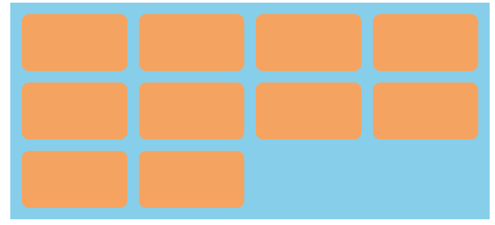

### Grid布局实现平均分配
grid-template-columns: repeat(4, 1fr);

### Grid布局实现平均分配
grid-template-columns: repeat(auto-fill, minmax(260px, 1fr));

### Grid合并行与列
grid-template-columns: repeat(4, 1fr);
grid-row: 1/3;
grid-column: 1/3;

